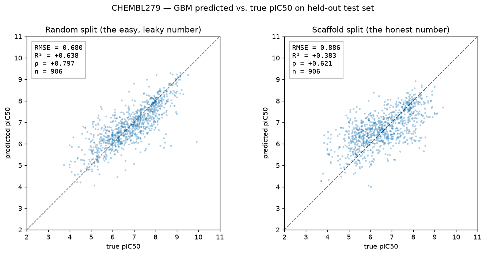
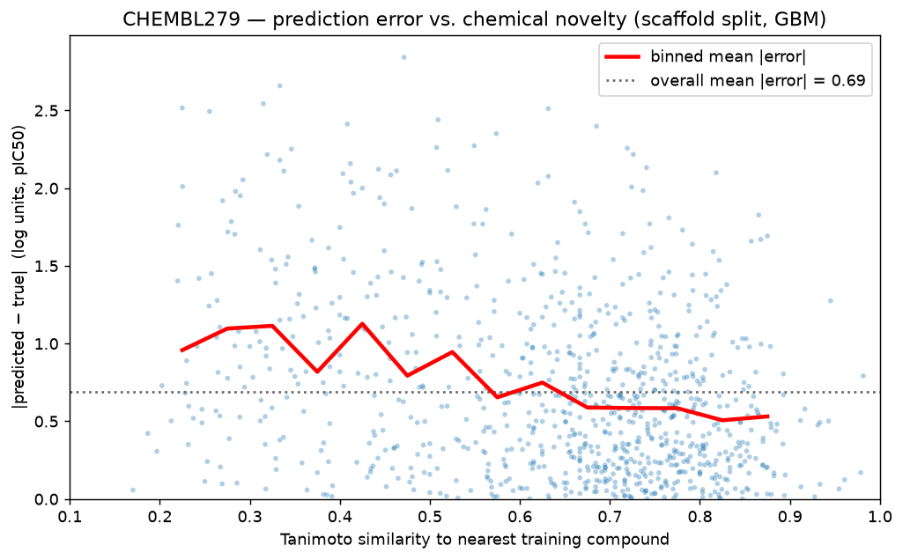
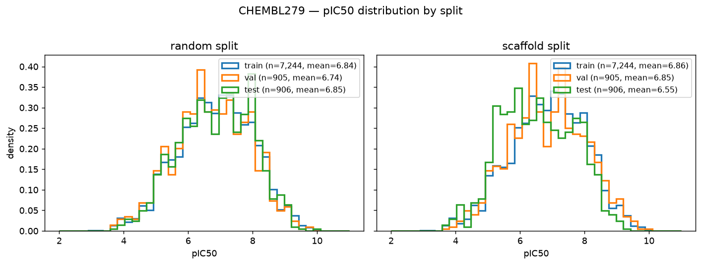

# ChEMBL Bioactivity Prediction

End-to-end project: pull bioactivity data from [ChEMBL](https://www.ebi.ac.uk/chembl/) for a single protein target, build a clean compound–activity dataset, train a model to predict potency (pIC50) from molecular structure, and characterize where that model can be trusted and where it cannot.

## Why this dataset

ChEMBL is the canonical open database of bioactive molecules with drug-like properties — ~2.4M compounds, ~20M measured activities, curated from primary medicinal-chemistry literature. It is the standard benchmark source for QSAR (Quantitative Structure–Activity Relationship) work, so results here are directly comparable to published baselines.

The domain framing matters: a "good" model isn't just one with low RMSE on a random split. Compounds in ChEMBL are heavily clustered by chemical series (a single paper often contributes 50+ close analogs), so a random split leaks structure between train and test. The honest evaluation here uses a **scaffold split** — held-out compounds share no Bemis–Murcko scaffold with training compounds — which is much closer to the real-world question "can this model score a new chemotype?"

## Target

Default target: **VEGFR2** (`CHEMBL279`) — a well-studied kinase with ~16k reported IC50 measurements. Configurable in [src/config.py](src/config.py).

## Project structure

```
chembl_bioactivity/
├── README.md
├── requirements.txt
├── src/
│   ├── config.py          # target ChEMBL ID, paths, thresholds
│   ├── chembl_client.py   # data-loading: pull activities via ChEMBL REST API
│   ├── preprocessing.py   # SMILES cleanup, unit harmonization, pIC50
│   ├── splits.py          # Bemis–Murcko scaffold split + random-split contrast
│   ├── features.py        # Morgan fingerprints (RDKit, ECFP4, 2048 bits)
│   ├── models.py          # ridge + gradient-boosted trees, both splits
│   └── evaluation.py      # RMSE / R² / Spearman + Tanimoto-NN domain-of-applicability
├── data/
│   ├── raw/               # raw ChEMBL pulls (CSV)        — gitignored
│   └── processed/         # cleaned, fingerprinted, split — gitignored
├── notebooks/
│   ├── results.ipynb      # produces the three figures below
│   └── figures/           # rendered PNGs (committed to the repo)
└── tests/
```

Data files are intentionally not committed — the pipeline regenerates them from ChEMBL in ~4 minutes.

## Quick start

```bash
python -m venv .venv && source .venv/bin/activate
pip install -r requirements.txt

python -m src.chembl_client     # pull ~16k activities for VEGFR2  (~2:40, network)
python -m src.preprocessing     # clean + dedup → 9,055 unique compounds
python -m src.splits            # scaffold split + random split
python -m src.features          # Morgan ECFP4 fingerprints, cached as .npz
python -m src.models            # ridge + GBM on both splits, save predictions
python -m src.evaluation        # headline metrics + Tanimoto-NN breakdown

jupyter nbconvert --to notebook --execute --inplace notebooks/results.ipynb  # figures
```

## Pipeline

1. **Pull** — [src/chembl_client.py](src/chembl_client.py) queries the ChEMBL REST API directly (with retry-on-5xx, since the public service returns transient 500s often enough that an un-retried pull is unreliable). Filters to `IC50` measurements with `standard_units == 'nM'` and a defined `standard_value`. **16,613 raw activities** for VEGFR2.
2. **Clean** — [src/preprocessing.py](src/preprocessing.py) standardizes SMILES with RDKit (largest organic fragment, sanitize, canonicalize), keeps only `relation == '='` (drops 21% censored measurements), converts nM IC50 → pIC50 = 9 − log₁₀(IC50_nM), and deduplicates by canonical SMILES taking the median pIC50 across replicates. Groups whose replicate measurements span more than 1 log unit are dropped as noisy (6.7% drop rate). **9,055 unique compounds** survive.
3. **Split** — [src/splits.py](src/splits.py) computes Bemis–Murcko scaffolds and produces both a scaffold split and a random split (each 80/10/10). The scaffold split sorts scaffold groups largest-first and greedily fills train, then val, then test — so train gets the 270-compound chemotype clusters and test gets singleton scaffolds with no analog in training.
4. **Featurize** — [src/features.py](src/features.py) computes Morgan ECFP4 fingerprints (radius=2, 2048 bits) with `rdFingerprintGenerator`, caches them as a compressed `.npz` (~660 KiB). Mean density ~2.8% on-bits — the typical drug-like-molecule range.
5. **Model** — [src/models.py](src/models.py) trains two models with the same hyperparameters on both splits: `RidgeCV` over a fixed alpha grid (baseline) and `HistGradientBoostingRegressor` with early stopping (main). Same hyperparameters on both splits, so the random-vs-scaffold gap is attributable to the data partition only.
6. **Evaluate** — [src/evaluation.py](src/evaluation.py) prints RMSE / R² / Spearman ρ on the test set for each (model, split) pair, the train/val/test gap (overfit check), and a **Tanimoto-nearest-neighbor breakdown** of the scaffold-split test set — the standard QSAR domain-of-applicability lens.

## Results

### Headline metrics (test set)

| Split | Model | RMSE | R² | Spearman ρ |
|---|---|---:|---:|---:|
| Random | Ridge | 0.78 | 0.53 | 0.73 |
| Random | **GBM** | **0.68** | **0.64** | **0.80** |
| Scaffold | Ridge | 0.98 | 0.25 | 0.54 |
| Scaffold | **GBM** | **0.89** | **0.38** | **0.62** |

The **0.26 R² gap** between random-split and scaffold-split GBM is the "honesty tax" — that much of the random-split performance is just analog memorization, not generalization to new chemotypes.

### Predicted vs. true, random vs. scaffold



Same model, same data, same number of test points. The cloud spreads visibly wider and regresses toward the mean on the right.

### Domain of applicability: error vs. chemical novelty



For each scaffold-split test compound, x is the Tanimoto similarity (ECFP4) to its nearest training neighbor; y is the absolute prediction error. The red binned-mean line falls monotonically: a test compound with a close training analog (Tanimoto > 0.7) has roughly **half** the expected error of a chemically novel compound (Tanimoto ≤ 0.3). The crossover of the binned mean and the overall mean (~0.6 Tanimoto) is a defensible numeric cutoff for "trustworthy prediction."

| NN Tanimoto to train | n | RMSE | R² | ρ |
|---|---:|---:|---:|---:|
| ≤ 0.30 (very dissimilar) | 47 | 1.19 | **−0.15** | +0.09 |
| 0.30 – 0.50 (dissimilar) | 150 | 1.18 | +0.04 | +0.29 |
| 0.50 – 0.70 (moderate) | 293 | 0.87 | +0.32 | +0.57 |
| > 0.70 (similar) | 416 | 0.72 | **+0.58** | +0.76 |

When a held-out compound has no close analog in training, the model is worse than predicting the training mean.

### pIC50 distribution by split (sanity)



Random-split train/val/test histograms overlap almost perfectly (means within 0.1 log). The scaffold-split test set is visibly shifted left (mean 6.55 vs train 6.86) — rarer scaffolds tend to come from exploratory papers and are slightly less potent on average. That is the real, mild distribution shift the model has to handle, not an artifact.

## Evaluation

Scope of the project:

- Here is the dataset I built (16,613 → 9,055) and what I had to throw away and why (censored measurements, replicate disagreements >1 log, salts, unparseable SMILES).
- Here is what the model learns on a random split — the easy, leaky number (R² = 0.64).
- Here is what it learns on a scaffold split — the honest number (R² = 0.38).
- And here is *where* the model breaks — predictions on chemically novel test compounds (Tanimoto NN ≤ 0.30) are worse than predicting the training mean, while predictions inside the model's domain of applicability (Tanimoto NN > 0.70) come close to random-split performance.

The contrast and the domain of applicability are the whole point.

## References

- ChEMBL: https://www.ebi.ac.uk/chembl/
- ChEMBL REST API docs: https://chembl.gitbook.io/chembl-interface-documentation/web-services/chembl-data-web-services
- Bemis & Murcko, *J. Med. Chem.* 1996 — scaffold definition
- Rogers & Hahn, *J. Chem. Inf. Model.* 2010 — ECFP (Morgan) fingerprints
- RDKit: https://www.rdkit.org/
